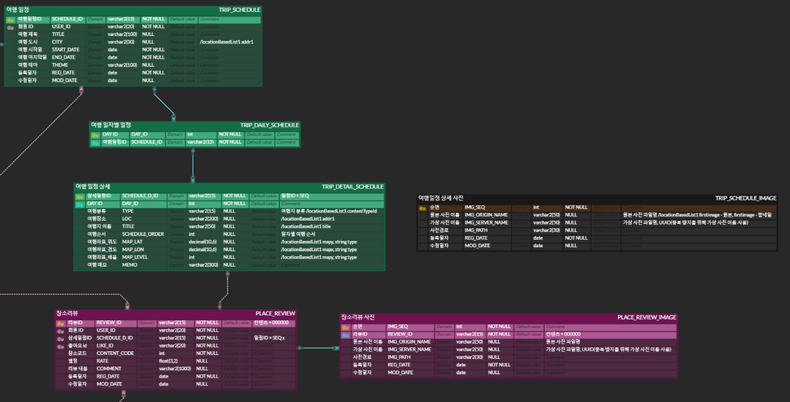
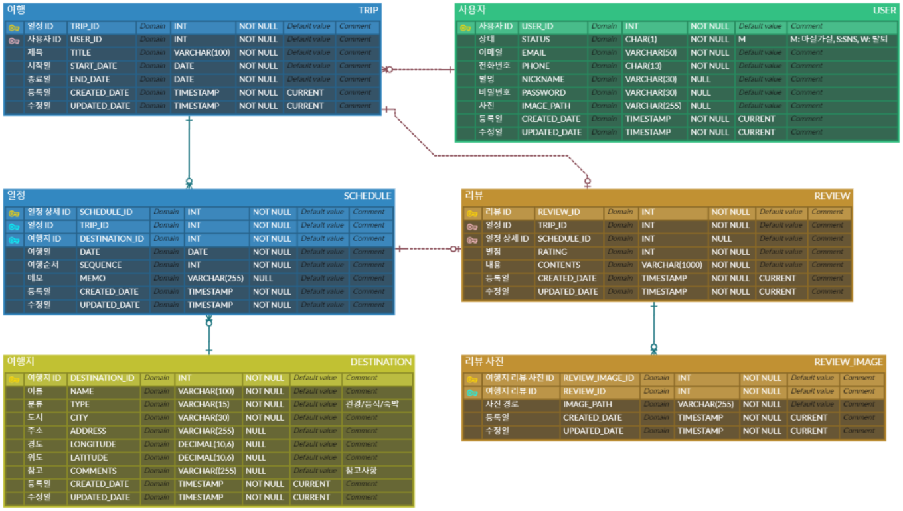

# 🏗️공사 중 마실가실

'1년이 지난 후, 나는 얼마만큼 프로젝트에서 개선할 부분을 찾을 수 있을까?' 라는 작은 의문에서 시작한 공사 중 마실가실입니다.


## 🛠️사용한 기술
* Java 17
* SpringBoot 3.1.0
* Spring Security 6.1.0
* Spring Data JPA
* MySQL 8.0


## 📝주요 개선 내용
### ERD 수정
<div>
    
    
</div>

(좌) 기존 ERD / (우) 리팩토링 ERD

🚨문제: 여행 일정 및 여행지 리뷰 테이블에서 동일한 여행지 데이터가 중복으로 저장  
🤓개선 방안: 중복 데이터에 대하여 제1정규화 수행 -> 여행지 테이블 별도 분리 후 관계 설정


### Entity 개선
* Auditing 기능 추가
  * 엔티티가 생성되고, 변경되는 시점을 감지하여 생성시각, 수정시각, 생성일, 수정일 등을 자동으로 기록
  * 여러 테이블의 공통 속성인 생성시각, 수정시각을 하나의 Entity(= BaseEntity)로 관리
```java
// 개선 전
@Entity
public class UserEntity implements UserDetails {
   // ...
   
   @Column(name = "reg_date", nullable = false)
   private LocalDate regDate;
   @Column(name = "mod_date", nullable = false)
   private LocalDate modDate;
}
```
```java
// 개선 후
@Entity
public class User extends BaseEntity implements UserDetails {
    // ...
}

@Getter
@EntityListeners(AuditingEntityListener.class)
@MappedSuperclass
public class BaseEntity {
    @Column(nullable = false, updatable = false)
    @CreatedDate
    private LocalDateTime createdDate;

    @Column(nullable = false)
    @LastModifiedDate
    private LocalDateTime updatedDate;
}
```


### REST API 구현
* URI에 자원의 정보를 표시
* 행위에 맞는 Http 메서드로 수정
```java
// 개선 전
@RestController
@RequestMapping("user")
public class UserController {
    @PostMapping("/signup")
    public void userSignUp(@RequestBody UserEntity userEntity) {
        userService.signUp(userEntity);
    }
    
    @PostMapping("/info")
    public ResponseEntity<?> getUserInfo(@RequestParam String accessToken) {
        JSONObject userInfo = userService.getUserInfo(accessToken);
        return ResponseEntity.ok().body(userInfo.toString());
    }

    // ...
}
```

```java
// 개선 후
@RestController
@RequestMapping("api/v2/users")
@RequiredArgsConstructor
public class UserController {
    @PostMapping("/new")
    @ResponseStatus(HttpStatus.CREATED)
    public void create(@RequestBody SignUpRequestDTO dto){
        dto.validUserDto();
        userService.create(dto);
    }

    @GetMapping("/me")
    @ResponseStatus(HttpStatus.OK)
    public UserDTO findMyInfo(){
        return userService.findMyInfo();
    }
}
```


### Test Code 추가
* TooManyActualInvocations을 방지하기 위해 @BeforeEach 대신 @MockBean의 doThrow()를 사용
```java
@SpringBootTest
@AutoConfigureMockMvc
public class UserServiceTest {
    @Autowired MockMvc mockMvc;
    @Autowired ObjectMapper objectMapper;
    @MockBean UserService userService;

    @Test
    @DisplayName("Controller: 회원 가입 실패, 중복된 이메일")
    void createFailDuplicateEmail() throws Exception {
        // given
        SignUpRequestDTO signUpDto = SignUpRequestDTO.builder()
                .status("M")
                .email("temp@email.com")
                .phone("01023698745")
                .nickname("name")
                .password("temp123!")
                .confirmPassword("temp123!")
                .build();

        // when // then
        doThrow(new BusinessException(ErrorCode.DUPLICATED_EMAIL))
                .when(userService).create(any(SignUpRequestDTO.class));

        mockMvc.perform(post("/api/v2/users/new")
                        .contentType(MediaType.APPLICATION_JSON)
                        .content(objectMapper.writeValueAsString(signUpDto)))
                .andExpect(status().isBadRequest())
                .andExpect(jsonPath("$.errorMessage").value("이미 존재하는 이메일 입니다."));

        verify(userService).create(refEq(signUpDto));
    }
}
```


### Refresh Token을 활용한 Access Token 재발급 기능 추가
```java
public TokenInfo reissue(TokenInfo reissueRequestDto) {
    try {
        jwtTokenProvider.getExpiration(reissueRequestDto.getAccessToken());
        throw new BusinessException(VALID_ACCESS_TOKEN);
    } catch (ExpiredJwtException e) {
        // Redis에 Refresh Token 존재 확인
        boolean hasStoredRefreshToken = redisUtil.hasKey("RT:" + reissueRequestDto.getRefreshToken());
        if(!hasStoredRefreshToken) {
            throw new BusinessException(LOGOUT_MEMBER);
        }

        String email = (String) redisUtil.get("RT:" + reissueRequestDto.getRefreshToken());
        User user = userRepository.findByEmail(email).orElseThrow(
                () -> new BusinessException(NOT_FOUND_MEMBER));

        // AccessToken 재발급
        UserDetails userDetails = new org.springframework.security.core.userdetails.User(
                user.getEmail(),
                user.getPassword(),
                Set.of(SecurityUtils.convertToAuthority(user.getRole()))
        );

        return jwtTokenProvider.generateAccessToken(userDetails);
    }
}
```


### Spring Security: 특정 url을 제외한 필터 적용
🚨문제: JwtAuthentificationFilter에서 Access Token의 유효성 검증을 수행하는데, 유효성 검증이 필요없는 회원가입이나 Access Token 재발행에서도 Filter가 동작  
🤓개선 방안: 특정 url에서만 filter가 동작하도록 수정  

🛠️해결1, **shouldNotFilter**  
\* 특정 경로에 대한 특정 필터만 제외
```java
public JwtAuthenticationFilter jwtAuthenticationFilterForSpecificUrls() {
    return new JwtAuthenticationFilter(jwtTokenProvider) {
        @Override
        protected boolean shouldNotFilter(HttpServletRequest request) {
            String path = request.getServletPath();
            return !("/api/v2/users/login".equals(path) || "/api/v2/users/me".equals(path) || "/api/v2/users/logout".equals(path));
        }
    };
}

@Bean
public SecurityFilterChain securityFilterChain(HttpSecurity http) throws Exception {
    http.httpBasic(AbstractHttpConfigurer::disable)
            .csrf(AbstractHttpConfigurer::disable)
            .cors(httpSecurityCorsConfigurer -> corsConfigurationSource())
            .sessionManagement(sessionManagement ->
                    sessionManagement.sessionCreationPolicy(SessionCreationPolicy.STATELESS)
            ).authorizeHttpRequests(auth -> auth
                    .requestMatchers("/api/v2/users/login").permitAll()
                    .requestMatchers("/api/v2/users/new").permitAll()
                    .requestMatchers("/api/v2/users/me", "/api/v2/users/logout").hasRole("USER")
                    .requestMatchers("/api/v2/users/reissue").permitAll()
                    .anyRequest().authenticated()
            )
            .addFilterBefore(jwtAuthenticationFilterForSpecificUrls(), UsernamePasswordAuthenticationFilter.class);

    return http.build();
}
```

🛠️해결2, **WebSecurityCustomizer**  
\* 경로에 대해 모든 필터 체인을 비활성화
```java
@Bean
public WebSecurityCustomizer webSecurityCustomizer() {
    return (web) -> web.ignoring()
            .requestMatchers("/api/v2/users/new", "/api/v2/users/reissue");
}

@Bean
public SecurityFilterChain securityFilterChain(HttpSecurity http) throws Exception {
    http.httpBasic(AbstractHttpConfigurer::disable)
            .csrf(AbstractHttpConfigurer::disable)
            .cors(httpSecurityCorsConfigurer -> corsConfigurationSource())
            .sessionManagement(sessionManagement ->
                    sessionManagement.sessionCreationPolicy(SessionCreationPolicy.STATELESS)
            ).authorizeHttpRequests(auth -> auth
                    .requestMatchers("/api/v2/users/login").permitAll()
                    .requestMatchers("/api/v2/users/new").permitAll()
                    .requestMatchers("/api/v2/users/me", "/api/v2/users/logout").hasRole("USER")
                    .requestMatchers("/api/v2/users/reissue").permitAll()
                    .anyRequest().authenticated()
            )
            .addFilterBefore(new JwtAuthenticationFilter(jwtTokenProvider), UsernamePasswordAuthenticationFilter.class);

    return http.build();
}
```


### Custom Error Code 작성
```java
@Getter
public enum ErrorCode {
    // 회원 가입
    EMAIL_VALIDATION(HttpStatus.BAD_REQUEST, "이메일 형식이 맞지 않습니다."),
    DUPLICATED_EMAIL(HttpStatus.BAD_REQUEST, "이미 존재하는 이메일 입니다."),
    PASSWORD_VALIDATION(HttpStatus.BAD_REQUEST, "비밀번호 형식이 맞지 않습니다."),
    NICKNAME_VALIDATION(HttpStatus.BAD_REQUEST, "닉네임 형식이 맞지 않습니다."),
    PHONE_NUMBER_VALIDATION(HttpStatus.BAD_REQUEST, "휴대폰 형식이 맞지 않습니다."),
    PASSWORD_CONFIRM_VALIDATION(HttpStatus.BAD_REQUEST, "비밀번호와 비밀번호 확인이 맞지 않습니다."),


    // 로그인
    CHECK_LOGIN_ID_OR_PASSWORD(HttpStatus.UNAUTHORIZED, "아이디 또는 비밀번호를 확인해주세요."),
    NOT_FOUND_MEMBER(HttpStatus.NOT_FOUND, "존재하지 않는 회원입니다."),


    // JWT
    MALFORMED_JWT(HttpStatus.BAD_REQUEST, "잘못된 JWT 형식입니다."),
    EXPIRED_JWT(HttpStatus.BAD_REQUEST, "만료된 JWT 토큰입니다."),
    UNSUPPORTED_JWT(HttpStatus.BAD_REQUEST, "지원하지 않은 JWT 서명입니다."),
    ILLEGAL_STATE_JWT(HttpStatus.BAD_REQUEST, "JWT 처리 중 오류가 발생하였습니다."),
    VALID_ACCESS_TOKEN(HttpStatus.UNAUTHORIZED, "Access Token의 유효기간이 남아있습니다."),
    LOGOUT_MEMBER(HttpStatus.NOT_FOUND, "로그아웃한 회원입니다."),
    INVALID_ACCESS_TOKEN(HttpStatus.NOT_FOUND, "유효하지 않은 Access Token입니다."),
    INVALID_REFRESH_TOKEN(HttpStatus.NOT_FOUND, "유효하지 않은 Refresh Token입니다."),
    NOT_FOUND_AUTHORITY(HttpStatus.NOT_FOUND, "존재하지 않는 권한입니다."),
    ;
}
```


### 패키지 구조 변경
> 도메인형 + 계층형 -> 도메인형으로 통일
```txt
├─domain
│  ├─tripschedule
│  │  ├─controller
│  │  ├─domain
│  │  ├─dto
│  │  ├─exception
│  │  ├─repository
│  │  └─service
│  ├─tripstory
│  │  ├─controller
│  │  ├─domain
│  │  ├─dto
│  │  ├─exception
│  │  ├─repository
│  │  └─service
│  └─user
│      ├─controller
│      ├─domain
│      ├─dto
│      ├─exception
│      ├─repository
│      └─service
├─global
│  ├─common
│  │  ├─error
│  │  ├─jwt
│  │  ├─model
│  │  └─redis
│  ├─config
│  └─util
└─infra
    ├─chatbot
    └─imageupload
```


### 정적 코드 분석 도구, SonarQube 추가
> 코드 품질 검사용 오픈 소스를 활용하여 버그 수정 및 유지보수성 등을 개선


## 🤹마실가실 리팩토링 블로그
[🔗마실가실 리팰토링](https://hj0216.tistory.com/category/PlayGround/%EB%A7%88%EC%8B%A4%EA%B0%80%EC%8B%A4%20%EB%A6%AC%ED%8C%A9%ED%86%A0%EB%A7%81)
